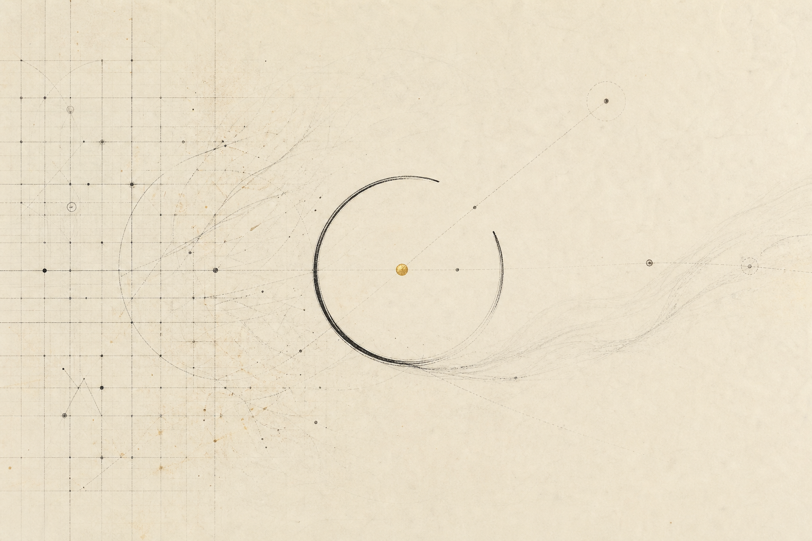
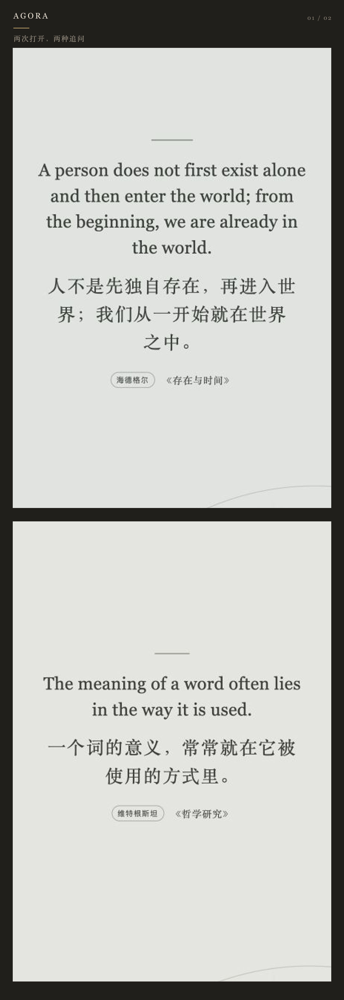
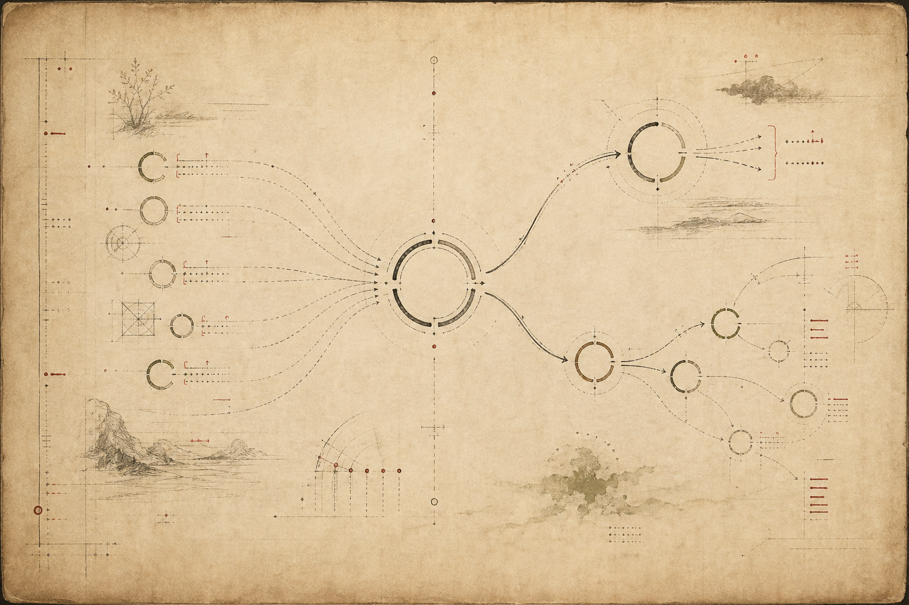
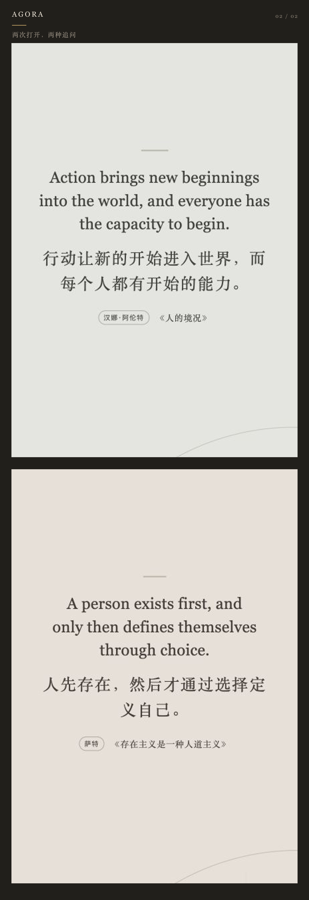

# 当答案越来越容易，我把新标签页留给了问题｜AGORA 开源

> AI 开始替我们回答越来越多的问题。我借助 AI 做了 AGORA：一个把西方哲学放进 Chrome 新标签页的开源工具。它不只呈现一句命题，也试着还原思想的来路与去处。

## 我们每天经过很多次，却从来不会停留的地方

浏览器的新标签页，是一个很奇怪的空间。

我们每天打开它很多次：搜索一个概念，进入一个网站，继续下一项工作。它总是出现，也总是立刻消失。

我开始想，在这个几乎只用来“抵达别处”的页面上，能不能留下一点不那么功利的东西？

不是天气、待办或新闻流，也不是一句看完就划走的励志金句。

而是一个值得停留几秒的问题。

## AI 越会回答，哲学越无法回避

这一两年，我们越来越习惯向 AI 提问。

它可以写代码、整理资料、生成方案，也可以迅速告诉我们一件事“怎么做”。但技术越往前走，另一些问题反而越来越近：

我们为什么要做？什么值得被优化，什么不应该被优化？一个越来越像人的系统，应该拥有什么样的性格和边界？当判断可以被外包，人还要为选择承担什么？

这些不是技术之外的问题。它们已经进入技术内部。

Anthropic 曾公开介绍为 Claude 进行“性格训练”的思考：除了避免伤害，一个 AI 是否还应该好奇、诚实、开放，如何面对价值分歧与关于自身的不确定性？这类工作本身就在说明，AI 的发展最终会遇到哲学，而不是绕开哲学。

当答案越来越容易获得，值得追问的问题会变得更加珍贵。

## 所以，我做了 AGORA

AGORA 是一个 Chrome 哲学新标签页。

名字来自古希腊的 Agora——人们相遇、讨论与辩论的公共广场。它不想把哲学变成供人膜拜的名人名言，而是想在每次打开浏览器时，临时搭起一小块可以思考的公共空间。

每次新建标签页，AGORA 会随机呈现一条西方哲学命题。默认同时显示中文与英文，也可以切换为简体中文、繁体中文或英文阅读。

首版收录了 27 位哲学家，内容会继续补充。但我并不想用数量制造“最全”的幻觉：对这个项目来说，比收录更多名字更重要的，是每条内容能否被解释、被追溯，也能被质疑和纠正。

## 它不是一面“哲学金句墙”

把一句话从上下文里摘出来并不难，难的是知道它为什么出现。

所以在 AGORA 里，点击页面中央的命题，会打开“读深一层”：你会先看到中英文命题译写、它试图回答的问题，以及一段尽量清楚的解释。

继续往下，才是我更在意的部分：它从哪些思想中生长出来；面对同一个问题，其他哲学家给过怎样不同的答案；后来的人又如何把它推向新的方向。

这里的“思想来处”“同题异答”和“后续回响”，不是简单的推荐算法，而是尽量把一句孤立的话放回一场延续了两千多年的对话。

例如，海德格尔谈“在世存在”，可以向前看到克尔凯郭尔、尼采与胡塞尔的问题线索，也可以向后走向阿伦特、萨特与德里达。它们并不总是直接影响，也不意味着彼此赞同；有时是继承，有时是反转，有时只是隔着时代对同一个问题作出不同回答。

因此，AGORA 会明确区分直接影响、传统中介与编辑性的主题重构。“呼应”或“分歧”，不等于存在直接引用。

首页的短句也不是冒充权威译本的逐字引文，而是基于所列作品与思想传统，为短阅读场景重新整理的“命题译写”。每条内容都会给出作品线索；如果归属、翻译或思想关系有问题，也欢迎在 GitHub 提交纠正。

## 这也是一次人与 AI 的共同制作

AGORA 的开发过程大量使用了 AI。

AI 帮我搭建代码、检查交互、整理资料、处理多语言，也参与了编辑性译写。但我越来越清楚地感到：工具可以加速制作，判断不能因此被省略。

为什么做这个产品，哪条内容值得出现，一句话是否失真，两位哲学家之间究竟是影响、分歧还是后来的编辑性对读——这些决定仍然需要人来承担。

我不想用“AI 生成”掩盖不确定，也不想把流畅当成正确。这个项目会继续借助 AI，但 AI 输出不会被当作史料；公开内容仍然需要人的复核与可追溯来源。

## 简单一点，也安静一点

AGORA 没有账号、广告、信息流和签到。

扩展不申请 Chrome 权限，没有后台脚本，也不加载远程代码。语言、主题和收藏只保存在浏览器本地；安装以后可以离线使用。

交互也尽量保持克制：左右方向键切换观点，空格随机一条，回车打开详情，`F` 收藏，`S` 保存为图片，`D` 打开菜单，`Esc` 返回。

视觉上做了三种主题——思想轨迹、意识手稿与命题档案。它们都保留了一个没有闭合的圆：完整答案被有意留出一道缺口，给下一次追问。

## 为什么开源

因为一个关于哲学的项目，不应该把自己包装成不可质疑的答案。

现在，AGORA 的代码已经以 GPL-3.0-or-later 开源；项目原创文本、数据结构与视觉素材采用 CC BY-SA 4.0。你可以查看实现、提出问题、修复错误，也可以沿着它继续做自己的版本。

我不期待每次打开新标签页，都能得到某种顿悟。

只希望在搜索、工作和下一次点击之前，我们偶尔还能停一下，问一句：为什么？

一页，一种思想。

—

**Chrome 商店**

https://chromewebstore.google.com/detail/imejfeghpobgmbnebcmmndkghbcmjcca

**项目源码**

https://github.com/NorthGateChat/agora-philosophy

**内容纠错与建议**

https://github.com/NorthGateChat/agora-philosophy/issues

**延伸阅读：Anthropic 对 Claude“性格训练”的说明**

https://www.anthropic.com/news/claude-character
